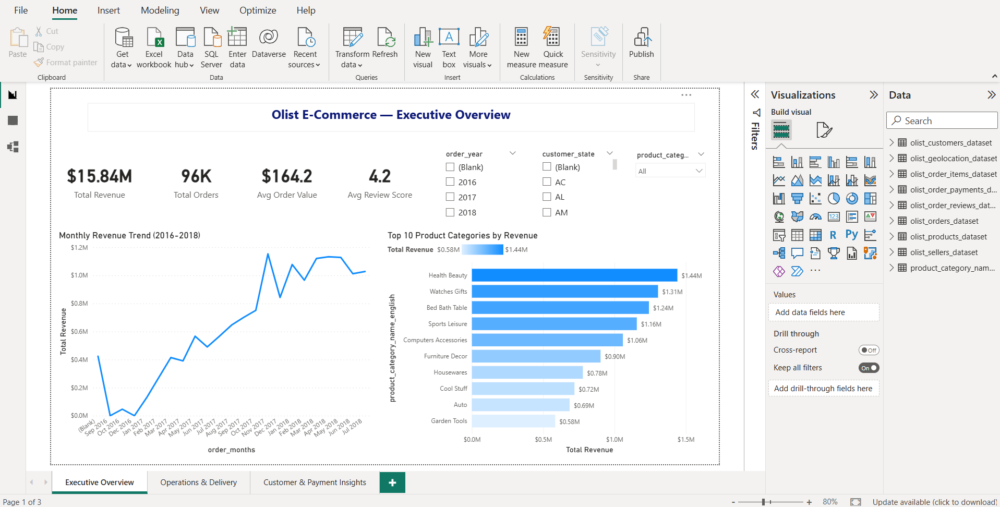
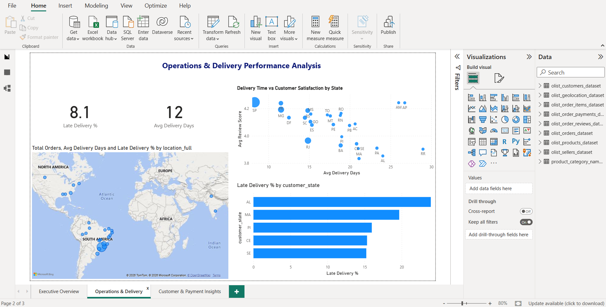
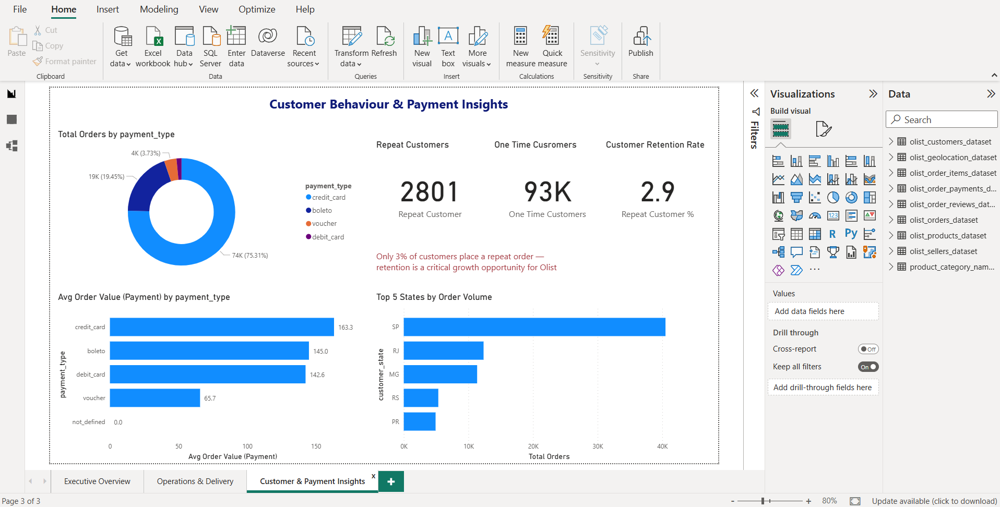

#  Olist E-Commerce Analytics Dashboard (Power BI)

##  Business Context
This project simulates the role of a Data Analyst at Olist, a Brazilian 
e-commerce marketplace. The goal was to answer key business questions 
from the Head of Operations:

- Where is revenue growing?
- Which regions are operationally inefficient?
- What is driving poor customer reviews?
- How do payment methods impact revenue?
- How strong is customer retention?

---

##  Dataset
- **Source:** [Brazilian E-Commerce Public Dataset by Olist — Kaggle](https://www.kaggle.com/datasets/olistbr/brazilian-ecommerce)
- **Size:** 100,000+ real orders (2016–2018)
- **Structure:** 9 relational tables joined using a Star Schema model

| Table | Description |
|---|---|
| olist_orders | Master orders table |
| olist_customers | Customer details |
| olist_order_items | Product line items & pricing |
| olist_order_payments | Payment method & value |
| olist_order_reviews | Customer ratings & comments |
| olist_products | Product catalogue |
| olist_sellers | Seller information |
| olist_geolocation | GPS coordinates by zip code |
| product_category_translation | Portuguese to English category names |

---

##  Tools & Skills Used
- **Power BI Desktop** — Dashboard building & visualisation
- **Power Query** — Data cleaning & transformation
- **DAX** — KPI measures & calculated metrics
- **Data Modelling** — Star Schema with 9 related tables
- **Business Analysis** — Insight generation & recommendations
- **GitHub** — Version control & project hosting

---

##  Dashboard Overview

### 🔹 Page 1 — Executive Overview
- **KPI Cards:** Total Revenue ($15.84M) | Total Orders (96K) | Avg Order Value ($164) | Avg Review Score (4.2)
- Monthly Revenue Trend (Sep 2016 – Jul 2018)
- Top 10 Product Categories by Revenue
- Interactive slicers — Year, State, Category

### 🔹 Page 2 — Operations & Delivery
- Map: Orders by State across Brazil
- Scatter Plot: Delivery Time vs Customer Review Score
- **KPI Cards:** Late Delivery % (8.1%) | Avg Delivery Days (12)
- Top 5 States with Worst Delivery Performance

### 🔹 Page 3 — Customer & Payment Insights
- Payment Method Distribution (Donut Chart)
- Average Order Value by Payment Type
- Customer Segmentation — Repeat vs One-time Customers
- Customer Retention Rate (2.9%)

---

##  Dashboard Screenshots

### Executive Overview

### Operations & Delivery

### Customer & Payment Insights

---

##  Key Insights

###  1. Revenue Growth
- Revenue grew **12x** from $0.1M in Sep 2016 to **$1.2M peak in Nov 2017**
- Strong seasonal spikes visible in Nov 2017 indicating Black Friday promotions
- Consistent upward trend confirms healthy marketplace growth

###  2. Product Performance
- **Health Beauty** is the top revenue category at **$1.44M**
- **Watches Gifts** second at **$1.31M**
- Top 10 categories contribute majority of total $15.84M revenue
- High dependency on top categories signals diversification opportunity

###  3. Delivery Impacts Customer Satisfaction
- Clear negative relationship: **longer delivery = lower review score**
- States with **20+ day delivery** average review scores **below 3.8/5**
- States under **10 day delivery** average review scores **above 4.2/5**

###  4. Regional Inefficiencies
- **AL (Alagoas)** has the highest late delivery rate at **20%+**
- **MA (Maranhão)** second worst at approximately **18%**
- These states are key targets for logistics improvement
- **SP (São Paulo)** dominates order volume — highest concentration of customers

###  5. Payment Behaviour
- **Credit card** dominates at **75% of all transactions**
- Credit card users spend **148% more** per order than voucher users
  - Credit card avg: **$163.3** per order
  - Voucher avg: **$65.7** per order
- Boleto (bank slip) users average **$145** per order

###  6. Customer Retention
- Only **2,801 out of 96,000** customers placed repeat orders
- Repeat customer rate is just **2.9%**
- **97.1% of customers never returned** after their first order
- This is the single biggest growth opportunity for Olist

---

##  Business Recommendations

| Priority | Recommendation | Expected Impact |
|---|---|---|
|  High | Optimize logistics in AL, MA, PI states | Improve review scores & reduce complaints |
|  High | Reduce delivery time below 10 days nationwide | Boost avg review score above 4.0 |
|  High | Introduce loyalty program for repeat purchases | Increase 2.9% retention rate |
|  Medium | Focus marketing on Health Beauty & Watches categories | Maximize revenue from proven categories |
|  Medium | Encourage credit card payments over vouchers | Increase avg order value |
|  Low | Diversify product categories | Reduce revenue concentration risk |

---

##  Files in Repository

| File | Description |
|---|---|
| `olist_dashboard.pbix` | Complete Power BI dashboard file |
| `Screenshots/` | Dashboard page screenshots |
| `README.md` | Project documentation |

---

##  How to Use
1. Download the `olist_dashboard.pbix` file
2. Open in **Power BI Desktop** (free download from Microsoft)
3. Explore all 3 pages using interactive slicers
4. Full dataset available on [Kaggle](https://www.kaggle.com/datasets/olistbr/brazilian-ecommerce)

---

##  Author
**Aiswarya KP** — Aspiring Data Analyst

-  Email: aiswaryakp104@gmail.com
-  LinkedIn: [linkedin.com/in/aiswarya-k-p](https://linkedin.com/in/aiswarya-k-p)
-  GitHub: [github.com/Aiswaryakp799](https://github.com/Aiswaryakp799)

---

*This project was built as part of my data analytics portfolio to demonstrate 
end-to-end analytics skills including data modelling, DAX, Power Query, 
dashboard design, and business insight generation.*
